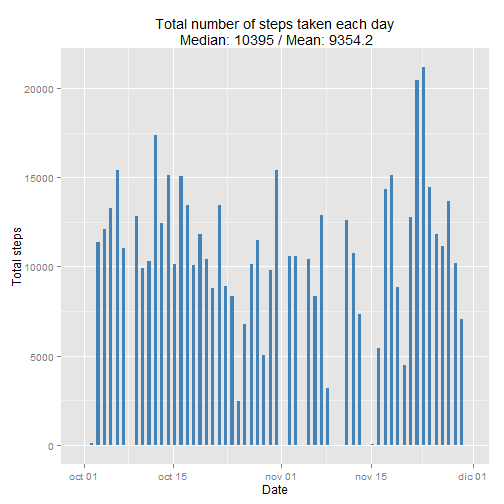
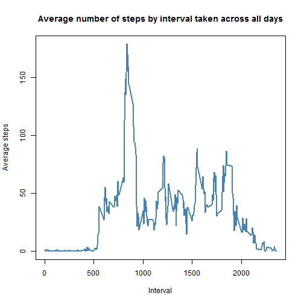
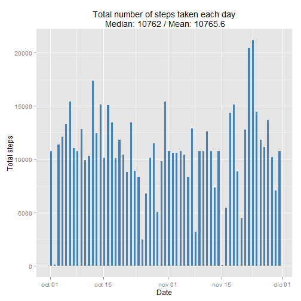
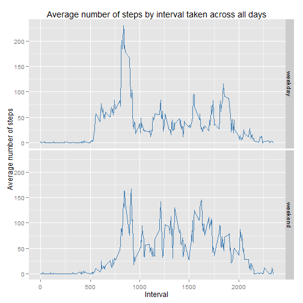

  
##### Loading and preprocessing the data

First, we have to read the data file:

```r
df <- read.csv2('./activity.csv', sep = ",", na.strings = 'NA')
```

And process the data, in this case, we convert the variable **date** from Factor to Date:


```r
df$date <- as.Date(df$date)
```
  
##### What is mean total number of steps taken per day?

*1. Make a histogram of the total number of steps taken each day*

*2. Calculate and report the mean and median total number of steps taken per day*

Here, I use 2 libraries (plyr and ggplot2).

First, I summarize the number of steps takeb by date and calculate the mean and median:


```r
library(plyr)
byDate <- aggregate(steps ~ date, data = df, sum, na.action=na.pass, na.rm=TRUE)
byDateMedian <- median(byDate$steps)
byDateMean <- mean(byDate$steps)
subtitle <- paste("Median:", byDateMedian, "/ Mean:",round(byDateMean, digits=1), sep=" ")
```

And then, we plot it:


```r
library(ggplot2)
ggplot(byDate, aes(date, weight=steps)) + geom_histogram(binwidth = 0.5, fill = "steelblue") + xlab("Date") + ylab("Total steps") + ggtitle(paste('Total number of steps taken each day\n',subtitle))
```

 

##### What is the average daily activity pattern?

*1. Make a time series plot (i.e. type = "l") of the 5-minute interval (x-axis) and the average number of steps taken, averaged across all days (y-axis)*

Aggregation by interval:


```r
byInterval <- ddply(df, .(interval), summarize, freq=length(steps), tot=sum(steps, na.rm = T), average = round(sum(steps, na.rm = T) / length(steps),digits = 2))
```

And then, we plot it:


```r
plot(byInterval$interval, byInterval$average, type="l", xlab= "Interval", ylab= "Average steps", col="steelblue" , lwd=2)
title("Average number of steps by interval taken across all days")
```

 

*2. Which 5-minute interval, on average across all the days in the dataset, contains the maximum number of steps?*


```r
interval <- byInterval[which(byInterval$average == max(byInterval$average)),"interval"]
```

The interval **835**, on average across all the days in the dataset, contains the maximum number of steps.

##### Imputing missing values

Note that there are a number of days/intervals where there are missing values (coded as NA). The presence of missing days may introduce bias into some calculations or summaries of the data.

*1. Calculate and report the total number of missing values in the dataset (i.e. the total number of rows with NAs)*


```r
totalNAs <- sum(is.na(df$interval) | is.na(df$steps) | is.na(df$date))
```

Columns **date** and **interval** have no NA. Only column **steps** has NAs.

The total number of missing values in the dataset (i.e. the total number of rows with NAs) is **2304**.

*2. Devise a strategy for filling in all of the missing values in the dataset. The strategy does not need to be sophisticated. For example, you could use the mean/median for that day, or the mean for that 5-minute interval, etc.*

My strategy is to fill the missing values with the mean for that 5-minute interval:


```r
meanByInterval <- ddply(df, .(interval), summarize, meanInt = round(mean(steps, na.rm = T), digits = 0))
```

*3. Create a new dataset that is equal to the original dataset but with the missing data filled in.*


```r
# Copy data frame
dfOk <- df
# Loop for each row and fill the missing steps with the mean for that 5-minute interval
for (i in 1:length(dfOk$steps)) { val = dfOk$steps[i]; dfOk$steps[i] <- ifelse(is.na(val), meanByInterval[which(meanByInterval$interval==df$interval[i]),"meanInt"], val) }
```

*4. Make a histogram of the total number of steps taken each day and Calculate and report the mean and median total number of steps taken per day. Do these values differ from the estimates from the first part of the assignment? What is the impact of imputing missing data on the estimates of the total daily number of steps?*


```r
byDateOk <- aggregate(steps ~ date, data = dfOk, sum, na.action=na.pass, na.rm=TRUE)
byDateMedianOk <- median(byDateOk$steps)
byDateMeanOk <- mean(byDateOk$steps)
byDateMeanNoRound <- round(byDateMean, digits=1)
byDateMeanOkRound <- paste('',round(byDateMeanOk, digits=1), sep='')
subtitleOk <- paste("Median:", byDateMedianOk, "/ Mean:",round(byDateMeanOk, digits=1), sep=" ")
ggplot(byDateOk, aes(date, weight=steps)) + geom_histogram(binwidth = 0.5, fill = "steelblue") + xlab("Date") + ylab("Total steps") + ggtitle(paste('Total number of steps taken each day\n',subtitleOk))
```

 

These values **DO DIFFER** from the estimates from the first part of the assignment. The impact of imputing missing data on the estimates of the total daily number of steps is **high**. With NAs, the Mean is **9354.2** and without NAs, is **10765.6**.

##### Are there differences in activity patterns between weekdays and weekends?

*For this part the weekdays() function may be of some help here. Use the dataset with the filled-in missing values for this part.*

*1. Create a new factor variable in the dataset with two levels – “weekday� and “weekend� indicating whether a given date is a weekday or weekend day.*


```r
# The wday component of a POSIXlt object is the numeric weekday (0-6 starting on Sunday)
dfOk$wday <- as.POSIXlt(dfOk$date,format="%Y-%m-%d")$wday
dfOk$week <- ifelse(dfOk$wday == 0 | dfOk$wday == 6,"weekend","weekday")
dfOk$week <- factor(dfOk$week)
```

*2. Make a panel plot containing a time series plot (i.e. type = "l") of the 5-minute interval (x-axis) and the average number of steps taken, averaged across all weekday days or weekend days (y-axis). See the README file in the GitHub repository to see an example of what this plot should look like using simulated data.*


```r
byIntervalOk <- ddply(dfOk, c("week", "interval"), summarize, average = mean(steps, na.rm = T))
ggplot(data=byIntervalOk, aes(x=interval,y=average)) + geom_line(colour="steelblue") + facet_grid(week ~ .) + xlab("Interval") + ylab("Average number of steps") + ggtitle('Average number of steps by interval taken across all days')
```

 
